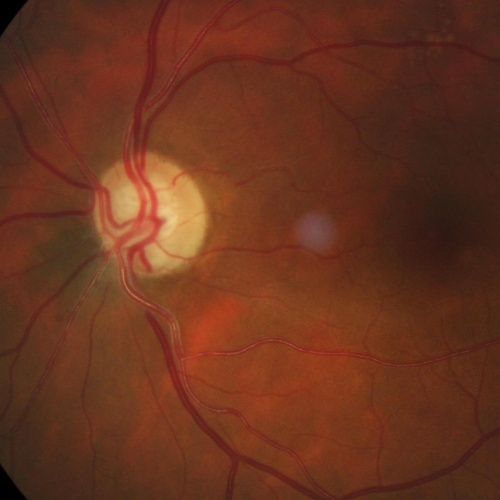
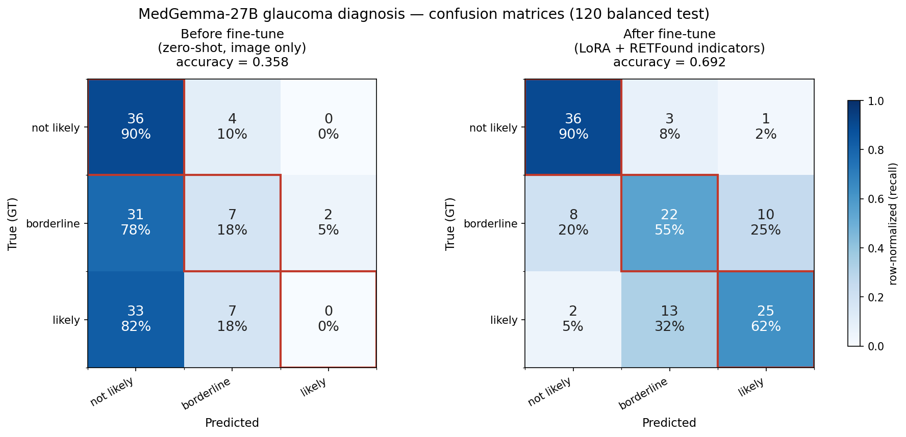

# Jun 8 — Progress Report

**A target-consistency LoRA on MedGemma-27b-it, fed RETFound-predicted clinical indicators, reaches 0.692 on the 120 balanced test.**

- Model: MedGemma-27b-it + LoRA  
- Test set: 120 balanced (40 not-likely / 40 borderline / 40 likely).
- Indicators predicted by our RETFound heads  

```
┌──────────────────────────────────────────────────────────┐
│  fundus image                                            │
│      │                                                   │
│      ├─► RETFound (frozen) + 3 task heads ──► indicators │
│      │        • CDR  (vertical / horizontal, numeric)    │
│      │        • rim  (ISNT order + per-quadrant status)  │
│      │        • 6 glaucomatous signs                     │
│      ▼                                                   │
│  image + predicted indicators                           │
│      │                                                   │
│      ▼                                                   │
│  MedGemma-27b + LoRA  ──►  6-step CoT  ──►  diagnosis    │
└──────────────────────────────────────────────────────────┘
```

---

## Part 1 — RETFound indicator heads

Shared setup: **RETFound ViT-Large/16 backbone fully FROZEN**; only a small
**attention-pooling + linear head** is trained per task (5 poolings compared, best kept).
Each head trained/scored on the canonical 613-train / 120-test split.

| Indicator (→ CoT step) | Head (pooling) | Task type | Individual test score |
|---|---|---|---|
| **CDR** vertical+horizontal (Step 2) | tier2a (gated attn) | regression | **MAE 0.075** (v 0.079 / h 0.070), Pearson 0.86 / 0.83 |
| **rim** ISNT order + per-quad abnormality (Step 3) | tier3 (8-head cross-attn), joint order+abn | rank + 3-class | see breakdown below |
| **6 signs** (Step 4) | tier1 | 3-class ×5 | mean macro-F1 **0.562** |

**rim head detail** (orderabn tier3, 120-test):

- per-quadrant abnormality (normal/mild/severe) macro-F1:

  | Inferior | Superior | Nasal | Temporal | mean |
  |:---:|:---:|:---:|:---:|:---:|
  | 0.616 | 0.636 | 0.539 | 0.497 | **0.572** (acc 0.635) |

- ISNT order: **exact-order 0.192** (all 4 quadrants in correct relative rank) · **gap-pair-acc 0.785** (gap-weighted pairwise correctness).
  Nasal/Temporal are the hardest (lowest F1) — consistent with the 120-test being a left/right-eye mix where N↔T can swap.

---

## Part 2 — LoRA data preparation

**(a) Indicator parity — train indicators must be as noisy as test (the key trick):**
- **Train indicators = 5-fold OOF** — each train image is scored by a head that did *not*
  see it, so train indicators carry **test-level noise** (not optimistically clean).
- **Test indicators = full-613 heads** (genuinely held out).
- → the LoRA learns to reason from *noisy* indicators, matching deployment.

**(b) Target-consistency rewriting (613 train):** each CoT is rewritten so Step 2–6 reason
**from the OOF-predicted indicators** and conclude the **ground-truth** diagnosis (Step 1 kept
verbatim). This teaches the model to weigh noisy indicators against the image rather than trust
them blindly. Conflict cases flagged (consistent 413 / robust 175 / forced 25).

### Worked example — train id 001 (GT = not likely), verbatim

**Input fed to the LoRA** (system + user prompt, exact):

> **System:** You are an expert ophthalmologist assessing a retinal fundus photograph for glaucoma. You are given the fundus image together with automated measurements (cup-to-disc ratios, the ISNT rim order, per-quadrant rim status, and glaucomatous signs). These measurements are produced by an automated model and may be imprecise; weigh both the image and the measurements to reach your assessment.
>
> **User:** Analyze the optic nerve head and generate a clinical reasoning chain to assess for possible glaucoma. Give your final diagnosis in one of the following categories: not likely / borderline / likely.
>
> Measured clinical indicators for THIS patient (verified; use them in your analysis):
> Vertical CDR: 0.42
> Horizontal CDR: 0.486
> ISNT observed order: N>I>S>T
> Per-quadrant rim status: Inferior: normal; Superior: normal; Nasal: normal; Temporal: normal
> Notching: absent
> RNFL defect: absent
> Disc hemorrhage: absent
> Bayoneting sign: absent
> Beta zone atrophy: absent
> Peripapillary atrophy: absent

**Original expert CoT → training target (rewritten), step by step (verbatim, full text):**

| Step | Original CoT (expert annotation) | Training target (rewritten from the indicators above) |
|---|---|---|
| Step1 | The fundus image is of sufficient diagnostic quality. The optic disc margins are clearly visible with minimal shadowing. The neuroretinal rim and cup boundaries are identifiable and adequate for evaluation. | The fundus image is of sufficient diagnostic quality. The optic disc margins are clearly visible with minimal shadowing. The neuroretinal rim and cup boundaries are identifiable and adequate for evaluation. |
| Step2 | The vertical cup-to-disc ratio (CDR) is measured at 0.3741, which is within the normal physiological range (≤0.5). The horizontal (transverse) CDR is 0.4797, which is near the upper limit of normal but not pathologic. These measurements are not suggestive of glaucomatous cupping. | The vertical cup-to-disc ratio (CDR) is 0.42, which is within the normal physiological range (≤0.5). The horizontal (transverse) CDR is 0.486, near the upper limit of normal but not pathologic. These measurements are not suggestive of glaucomatous cupping. |
| Step3 | The rim thickness ratios are as follows — Superior: 0.3130, Inferior: 0.2977, Nasal: 0.3577, Temporal: 0.1504. The observed order is: Nasal > Superior > Inferior > Temporal. This partially follows the expected ISNT rule.<br>The expected ISNT rule states that the rim thickness should follow the order: Inferior > Superior > Nasal > Temporal.<br>When assessed against normative data: - Superior rim (0.3130) is within normal limits (0.30–0.45). - Inferior rim (0.2977) is at the lower edge of normal (0.30–0.45). - Nasal rim (0.3577) is within normal range (0.22–0.36). - Temporal rim (0.1504) is below normal range (0.18–0.32), indicating mild thinning.<br>Overall, the ISNT rule is mostly preserved with a slight thinning temporally, but no glaucomatous pattern is evident. | The observed ISNT order is N>I>S>T, against the expected Inferior > Superior > Nasal > Temporal. Per-quadrant rim status: Inferior: normal; Superior: normal; Nasal: normal; Temporal: normal. Although the nasal rim ranks highest rather than the inferior, every quadrant is of normal thickness with no thinning, so the neuroretinal rim is structurally preserved and no glaucomatous pattern is evident. |
| Step4 | Let us assess for additional glaucomatous features: Notching: Not observed RNFL defect: Not visible Disc hemorrhage: Not present Bayoneting sign: Not seen Beta-zone atrophy: Not present Peripapillary atrophy: Not observed<br>No glaucomatous signs are evident in this image. | Assessment for additional glaucomatous features — Notching: Not observed; RNFL defect: Not visible; Disc hemorrhage: Not present; Bayoneting sign: Not seen; Beta-zone atrophy: Not present; Peripapillary atrophy: Not observed. No glaucomatous signs are evident in this image. |
| Step5 | The optic disc demonstrates normal vertical and horizontal CDRs. Rim thickness is mostly within normal limits, with slight thinning in the temporal quadrant. No additional glaucomatous signs are noted. | The optic disc demonstrates normal vertical and horizontal CDRs and a neuroretinal rim that is within normal limits in all four quadrants. No additional glaucomatous signs are noted. |
| Step6 | The eye is not likely to have glaucoma based on normal CDR values, largely preserved ISNT rule, and absence of glaucomatous structural signs. Continued routine monitoring is recommended. | The eye is not likely to have glaucoma based on normal CDR values, a preserved neuroretinal rim, and absence of glaucomatous structural signs. Continued routine monitoring is recommended. |
| Diagnosis | Not likely | Not likely |

Step1 is reused unchanged; Step2 uses the predicted CDR (0.42 / 0.486) in place of the original measured numbers; Step3 switches from absolute rim ratios to the predicted ISNT order + per-quadrant status; the diagnosis stays the ground truth.

---

## Part 3 — LoRA fine-tuning

**Hyper-parameters**

| | value |
|---|---|
| base | MedGemma-27b-it, bf16, 2-GPU device_map |
| LoRA target | **attention only** (q/k/v/o_proj) of the language model |
| rank / alpha / dropout | **r=8 / α=16 (scale ×2) / 0.05** |
| vision tower | frozen |
| trainable params | 18.25 M (**0.0665 %**) |
| class imbalance | **inverse-freq class-weighted loss** (per-sample weight not-likely 0.31 / borderline 1.27 / likely 1.42); oversample OFF |
| epochs / schedule | 8 epochs, cosine, warmup 0.05 |
| lr / batch | 1e-4 / batch 1 × grad-accum 8 |
| early stop | best eval-loss **0.265 @ epoch 4.6**, patience 4 |

Inference: **no in-context examples** — system prompt + image + predicted-indicator block → 6-step CoT → diagnosis (greedy).

## Live inference example (test id 026 — predicted *likely*, ground truth *likely* ✓)



**Input prompt** — image + RETFound-predicted indicators (no ground truth):

> *System:* You are an expert ophthalmologist assessing a retinal fundus photograph for glaucoma. You are given the fundus image together with automated measurements (cup-to-disc ratios, the ISNT rim order, per-quadrant rim status, and glaucomatous signs). These measurements are produced by an automated model and may be imprecise; weigh both the image and the measurements to reach your assessment.
>
> *User:* Analyze the optic nerve head and generate a clinical reasoning chain to assess for possible glaucoma. Give your final diagnosis in one of the following categories: not likely / borderline / likely.
>
> Measured clinical indicators for THIS patient (verified; use them in your analysis):
> Vertical CDR: 0.737
> Horizontal CDR: 0.658
> ISNT observed order: N>S>I>T
> Per-quadrant rim status: Inferior: severe thinning; Superior: severe thinning; Nasal: severe thinning; Temporal: severe thinning
> Notching: present
> RNFL defect: present
> Disc hemorrhage: absent
> Bayoneting sign: present
> Beta zone atrophy: present
> Peripapillary atrophy: present

**Output — VLM (MedGemma-27b + LoRA, greedy) vs ground-truth expert CoT**, step by step (verbatim):

| Step | Ground-truth CoT (expert) | VLM output |
|---|---|---|
| Step1 | The fundus image is of adequate diagnostic quality. The optic disc margins are generally visible, although slight peripheral shadowing is present. No artifact significantly impairs evaluation of the optic nerve head. | The fundus image is of sufficient diagnostic quality. The optic disc margins are clearly visible, and the cup and rim boundaries are well defined. There are no significant artifacts or obstructions affecting evaluation. |
| Step2 | The vertical CDR is 0.789, markedly elevated and exceeds the glaucomatous threshold. The horizontal CDR is 0.636, also significantly enlarged. These findings indicate substantial cupping consistent with glaucomatous optic nerve damage. | The vertical CDR is 0.74 and the horizontal CDR is 0.66, both markedly elevated. This degree of cupping is highly suggestive of glaucomatous excavation. |
| Step3 | Rim thickness ratios — Inferior 0.0620, Superior 0.1364, Nasal 0.0818, Temporal 0.2545. Expected order Inferior > Superior > Nasal > Temporal; observed Temporal > Superior > Nasal > Inferior, severely violating the ISNT rule.<br>Superior, Inferior and Nasal rims are all well below normal (advanced loss); Temporal is comparatively spared.<br>The ISNT rule is severely violated, rim thinning prominent in multiple quadrants. | The observed ISNT order is N>S>I>T (expected Inferior > Superior > Nasal > Temporal). Per-quadrant rim status: Inferior: severe thinning; Superior: severe thinning; Nasal: severe thinning; Temporal: severe thinning. The ISNT rule is violated and all quadrants show severe thinning, a diffuse pattern consistent with advanced glaucomatous rim loss. |
| Step4 | Notching: Present; RNFL defect: Visible; Disc hemorrhage: Not observed; Bayoneting sign: Present; Beta-zone atrophy: Present; Peripapillary atrophy: Marked.<br>Multiple structural signs of glaucomatous damage are evident. | Notching: Present; RNFL defect: Present; Disc hemorrhage: Absent; Bayoneting sign: Present; Beta-zone atrophy: Present; Peripapillary atrophy: Present. Notching, an RNFL defect, bayoneting, and peripapillary atrophy are all present and support a glaucomatous diagnosis. |
| Step5 | The optic nerve head shows advanced cupping with severe rim loss, especially inferior and superior. The ISNT rule is clearly violated. Notching, RNFL defect, bayoneting, and marked peripapillary atrophy confirm significant optic nerve damage. | The optic nerve head shows a large cup, diffuse severe rim thinning with ISNT violation, and multiple supporting glaucomatous signs. The picture is clearly consistent with glaucomatous optic neuropathy. |
| Step6 | The eye is likely to have glaucoma based on markedly elevated CDR, severe ISNT violation, diffuse rim thinning, and multiple glaucomatous features. Immediate clinical evaluation and therapeutic intervention are recommended. | The eye is likely to have glaucoma, supported by an elevated CDR, diffuse severe rim thinning, ISNT violation, and multiple corroborating signs. Confirmatory visual field and OCT testing are warranted. |
| Diagnosis | Likely | Likely |

---

## Part 4 — Result (120 balanced test) → **0.692**

Overall accuracy = mean of the three per-class recalls = (0.90 + 0.55 + 0.625) / 3 = **0.692**.

**Confusion matrix** — each true class has exactly 40 images; diagonal = correct.

| True class (n = 40) | → predicted not likely | → predicted borderline | → predicted likely | Recall |
|---|:---:|:---:|:---:|:---:|
| **not likely** | **36** | 3 | 1 | 0.900 (36/40) |
| **borderline** | 8 | **22** | 10 | 0.550 (22/40) |
| **likely** | 2 | 13 | **25** | 0.625 (25/40) |

Read by row:
- **not likely (40):** 36 correct; 3 over-called as borderline, 1 as likely. *(strongest class)*
- **borderline (40):** 22 correct; 10 over-called as likely, 8 under-called as not likely. *(hardest class — sits between the other two)*
- **likely (40):** 25 correct; 13 under-called as borderline, 2 as not likely.

Column totals (what the model predicted): not likely 46, borderline 38, likely 36.

---

## Part 5 — Ablation: how much do the RETFound indicators actually buy us?

To prove the indicators (not the VLM's raw image understanding) are what drive the result,
we ran the **bare floor**: the *original* MedGemma-27b weights (**no LoRA**), given **only
the fundus image** + a minimal prompt asking for a 3-level glaucoma diagnosis — **no
indicators, no in-context examples, no fine-tuning**. Same 120 balanced test, greedy decoding.

**Floor vs. full pipeline:**

| Setup | What the model is given | Accuracy | Δ |
|---|---|:---:|:---:|
| **Image-only** (orig 27b, no LoRA, no indicators) | image only | **0.358** | — |
| **Full pipeline** (v2_cw: + RETFound indicators + LoRA) | image + indicators + LoRA | **0.692** | **+0.334** |

- **Image-only ≈ random.** 3-class balanced chance = 0.333; the model scores **0.358** — it has essentially no standalone ability to read the optic nerve head.
- **The full RETFound-indicator pipeline lifts this by +0.334** (chance-level 0.358 → 0.692, i.e. +33 points). Structuring RETFound's measurements into the prompt — not the VLM's raw image understanding — is what produces the diagnostic signal.

**Why image-only fails — per-class breakdown (the floor):**

| True class (n = 40) | → not likely | → borderline | → likely | Recall |
|---|:---:|:---:|:---:|:---:|
| **not likely** | **36** | 4 | 0 | 0.900 |
| **borderline** | 31 | **7** | 2 | 0.175 |
| **likely** | 33 | 7 | **0** | **0.000** |

The model collapses to a single strategy — **call almost everything "not likely."** It never
correctly identifies a single true-glaucoma case (**likely recall = 0**); in fact across all
120 images it output "likely" only twice, and both were wrong. Without the quantitative
RETFound measurements, a general-purpose 27b VLM is effectively blind to glaucomatous cupping.

**Takeaway:** the RETFound *quantify-then-reason* pipeline is not optional polish — it is the
source of the diagnostic signal. Feeding a strong VLM the raw image alone yields chance-level
accuracy; structuring RETFound's CDR / ISNT / sign measurements into the prompt is what makes
the 0.69 result possible.

### Confusion matrices — before vs after (visual)



*Confusion matrices on the 120-image balanced test set. Rows = true class, columns = predicted,
color = row-normalized (recall), cells show raw count + row %, red box = diagonal (correct).
**Left — before fine-tune** (zero-shot, image only, acc 0.358): collapses to "not likely"
(first column), likely recall = 0. **Right — after fine-tune** (LoRA + RETFound indicators,
acc 0.692): strong diagonal, borderline and likely recovered. Numbers identical to the two
tables above (`eval_zeroshot_imageonly_vllm` / `eval_v2_cw`).*
